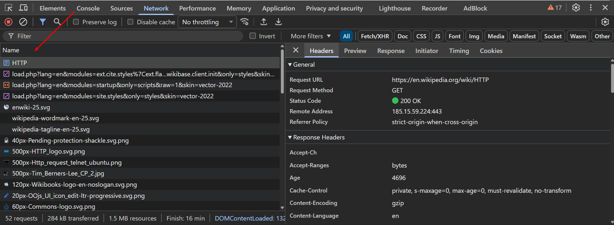
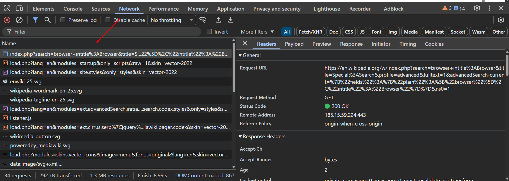
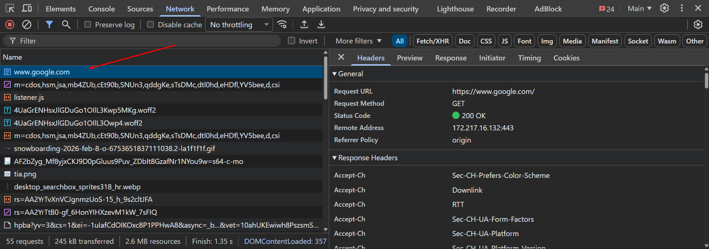

# Лабораторная работа PHP № 1

## Задание 1. Анализ HTTP-запросов. Часть 1

### Найдите первый запрос к странице, он будет назван как HTTP и изучите следующие аспекты

- URL запроса
  - <https://en.wikipedia.org/wiki/HTTP>

- Метод запроса. Почему именно данный метод используется для загрузки страницы?
  - Method: GET
  - Почему: GET используется для получения ресурса (страницы) с сервера. Пользователь «просит» отдать HTML-документ, не изменяя данные на сервере.

- Статус ответа. Что означает статус ответа?
  - Status Code: 200 OK — запрос выполнен успешно, сервер вернул запрошенный документ.

- Заголовки запроса и ответа. Какие заголовки присутствуют и какую информацию они содержат?

### Request Headers

| Заголовок                   | Значение                                                     | Назначение                                                                             |
| --------------------------- | ------------------------------------------------------------ | -------------------------------------------------------------------------------------- |
| `:method`                   | `GET`                                                        | Метод HTTP-запроса. Используется для получения ресурса без изменения данных на сервере |
| `:scheme`                   | `https`                                                      | Протокол передачи данных (защищённое соединение)                                       |
| `:authority`                | `en.wikipedia.org`                                           | Домен сервера, к которому отправляется запрос                                          |
| `:path`                     | `/wiki/HTTP`                                                 | Путь к запрашиваемому ресурсу (статья HTTP)                                            |
| `User-Agent`                | `Mozilla/5.0 (Windows NT 10.0; Win64; x64) Chrome/144.0.0.0` | Идентифицирует браузер и операционную систему клиента                                  |
| `Accept`                    | `text/html, application/xhtml+xml, application/xml, */*`     | Типы данных, которые браузер может принять от сервера                                  |
| `Accept-Language`           | `ru-RU, ru; en-US; en; ro`                                   | Предпочитаемые языки пользователя                                                      |
| `Accept-Encoding`           | `gzip, deflate, br, zstd`                                    | Поддерживаемые алгоритмы сжатия данных                                                 |
| `Cache-Control`             | `max-age=0`                                                  | Указывает серверу, что требуется актуальная версия ресурса                             |
| `Referer`                   | `https://elearning.usm.md/`                                  | Страница, с которой пользователь перешёл на Wikipedia                                  |
| `Cookie`                    | `VEECid, WMF-Last-Access, GeoIP и др.`                       | Данные сессии и служебная информация пользователя                                      |
| `Upgrade-Insecure-Requests` | `1`                                                          | Указывает предпочтение защищённого соединения HTTPS                                    |
| `Sec-Fetch-Dest`            | `document`                                                   | Тип запрашиваемого ресурса (документ)                                                  |
| `Sec-Fetch-Mode`            | `navigate`                                                   | Режим навигации (переход пользователя)                                                 |
| `Sec-Fetch-Site`            | `cross-site`                                                 | Запрос выполнен с другого сайта                                                        |
| `Sec-Fetch-User`            | `?1`                                                         | Запрос инициирован пользователем                                                       |

### Response Headers

| Заголовок                   | Значение                                                        | Назначение                                                  |
| --------------------------- | --------------------------------------------------------------- | ----------------------------------------------------------- |
| `Status Code`               | `200 OK`                                                        | Запрос успешно обработан сервером                           |
| `Content-Type`              | `text/html; charset=UTF-8`                                      | Тип возвращаемого содержимого (HTML-страница)               |
| `Content-Encoding`          | `gzip`                                                          | Сжатие данных для уменьшения объёма передаваемой информации |
| `Content-Language`          | `en`                                                            | Язык содержимого страницы                                   |
| `Content-Length`            | `71318`                                                         | Размер тела ответа в байтах                                 |
| `Cache-Control`             | `private, s-maxage=0, max-age=0, must-revalidate, no-transform` | Управление кэшированием страницы                            |
| `Last-Modified`             | `Sat, 07 Feb 2026 21:21:01 GMT`                                 | Дата последнего изменения ресурса                           |
| `Server`                    | `mw-web.eqiad.main`                                             | Информация о сервере MediaWiki                              |
| `Set-Cookie`                | `WMF-DP=e52`                                                    | Установка cookie для клиента                                |
| `Strict-Transport-Security` | `max-age=106384710; includeSubDomains; preload`                 | Принудительное использование HTTPS                          |
| `Content-Security-Policy`   | `script-src, style-src, default-src …`                          | Ограничение источников скриптов и стилей (защита от XSS)    |
| `Vary`                      | `Accept-Encoding, Cookie, User-Agent`                           | Указывает, какие заголовки влияют на кэширование            |
| `X-Cache`                   | `cp3069 miss, cp3069 hit/3`                                     | Информация о работе CDN-кэша                                |
| `X-Cache-Status`            | `hit-front`                                                     | Ответ был получен из кэша                                   |
| `X-Request-ID`              | `08d7459c-a940-4ef7-bca5-c00281914559`                          | Уникальный идентификатор запроса                            |

- Есть ли тело запроса или ответа? Если да, то что в нем содержится?
  - Для GET обычно тела запроса нет. Response body содержит HTML-разметка страницы (document).

- Какие ещё запросы отправлены при загрузке и почему
  - После основного HTML браузер почти всегда грузит дополнительные ресурсы:
    - CSS (стили) — чтобы страница выглядела правильно

    - JS (скрипты) — интерактивность, меню, трекинг, модульные функции

    - Images/SVG — иконки/логотипы

    - Fonts — шрифты

    - API/XHR/fetch — дополнительные данные (например, подсказки, модули)

    - MediaWiki ресурсы — Wikipedia подгружает много служебных файлов

  - Дополнительные запросы нужны для загрузки стилей, скриптов, изображений, без которых страница не отображается корректно



- Перейдите по следующему адресу: <https://en.wikipedia.org/wiki/HTTPdsfdfs> и повторите анализ для этого запроса. Какой статус ответа вы получили и почему?
  - Status Code: 404 Not Found, потому что запрошенная страница с таким названием отсутствует (сервер не нашёл ресурс по указанному пути).

## Задание 2. Анализ поиска (Special:Search, слово browser)

- URL запроса. Какой URL используется для выполнения поиска?
  - <https://en.wikipedia.org/w/index.php>

- Метод запроса. Почему используется именно этот метод?
  - Для выполнения поиска используется метод GET. Причины использования метода GET:
    - поиск является операцией получения данных и не изменяет состояние сервера;

    - параметры поиска передаются в URL, что позволяет:

    - сохранять и делиться ссылкой на результаты поиска;

    - кэшировать запросы;

    - видеть параметры запроса в адресной строке браузера.

- Query Parameters. Какие параметры передаются в запросе, что они означают и для чего используются?
  - В строке запроса передаются следующие параметры:
    - search=browser intitle:Browser

      Основной поисковый запрос пользователя. Указывает ключевое слово browser и дополнительное условие поиска в заголовке статьи (intitle).

    - title=Special:Search

      Определяет служебную страницу Wikipedia, которая обрабатывает поисковые запросы.

    - profile=advanced

      Указывает, что используется расширенный режим поиска.

    - fulltext=1

      Включает поиск по полному тексту статей.

    - advancedSearch-current

      Содержит параметры расширенного поиска в формате JSON, включая:
      - обычный текст запроса;

      - условия поиска по заголовку статьи.

    - ns0=1

      Ограничивает поиск основным пространством имён (только статьи, без обсуждений и служебных страниц).



## Задание 3. Анализ HTTP-запросов. Часть 3



## Задание 4. Составление HTTP-запросов

- Составьте GET-запрос к серверу по адресу <http://sandbox.usm.com>, указав в заголовке User-Agent ваше имя и фамилию. Что такое User-Agent и для чего он используется?
  - GET request:

  ```bash
  curl -X GET http://sandbox.usm.com \
  -H "User-Agent: Ivan Ivanov"
  ```

  - User-Agent — это HTTP-заголовок, который сообщает серверу информацию о клиенте, отправляющем запрос:
    - браузер или приложение

    - версия клиента

    - иногда ОС

  - Используется для:
    - логирования и аналитики

    - адаптации ответа под клиента

    - ограничения или фильтрации запросов

    - отладки

- Составьте POST-запрос к серверу по адресу <http://sandbox.usm.com/cars>, указав в теле запроса следующие параметры:
  - make: марка автомобиля (например, "Toyota")
  - model: модель автомобиля (например, "Corolla")
  - year: год выпуска автомобиля (например, 2020)
    - POST Request:

    ```bash
    curl -X POST http://sandbox.usm.com/cars \
    -H "Content-Type: application/x-www-form-urlencoded" \
    -d "make=Toyota&model=Corolla&year=2020"
    ```

- Какие еще методы HTTP-запросов существуют и для чего они используются?
  - Основные методы:
    - GET — получить данные

    - POST — создать новый ресурс

    - PUT — полностью заменить существующий ресурс

    - PATCH — частично обновить ресурс

    - DELETE — удалить ресурс

    - HEAD — получить только заголовки ответа

- Составьте PUT-запрос к серверу по адресу <http://sandbox.usm.com/cars/1>, указав в заголовке User-Agent ваше имя и фамилию, в заголовке Content-Type значение application/json и в теле запроса следующие параметры:

  ```json
  {
    "make": "Toyota",
    "model": "Corolla",
    "year": 2021
  }
  ```

  - PUT request:

  ```bash
  curl -X PUT http://sandbox.usm.com/cars/1 \
  -H "User-Agent: Ivan Ivanov" \
  -H "Content-Type: application/json" \
  -d '{
    "make": "Toyota",
    "model": "Corolla",
    "year": 2021
  }'
  ```

- В чем разница между PATCH и PUT запросами?

| PUT                                        | PATCH                                 |
| ------------------------------------------ | ------------------------------------- |
| Полностью заменяет ресурс                  | Частично изменяет ресурс              |
| Все поля обязательны                       | Можно передать только изменяемые поля |
| Если поле не передано — может быть удалено | Остальные поля остаются без изменений |

- **PUT** — обновляем весь объект
- **PATCH** — меняем только `year`

- Напишите один из возможных вариантов ответа сервера следующий запрос:

```bash
POST /cars HTTP/1.1
Host: sandbox.com
Content-Type: application/json
User-Agent: John Doe
model=Corolla&make=Toyota&year=2020
```

- Пример ответа сервера:

  ```bash
  HTTP/1.1 201 Created
  Content-Type: application/json

  {
    "id": 1,
    "make": "Toyota",
    "model": "Corolla",
    "year": 2020
  }
  ```

- Предположите ситуации, когда сервер на запрос выше может вернуть HTTP-коды состояния 200, 201, 400, 401, 403, 404, 500.
  - 200 OK

  Запрос успешно обработан (например, сервер допускает POST без создания нового ресурса)
  - 201 Created

  Ресурс успешно создан (типичный ответ для POST)
  - 400 Bad Request

  Некорректные данные (неверный формат тела, отсутствуют обязательные поля)
  - 401 Unauthorized

  Не переданы или неверны данные аутентификации
  - 403 Forbidden

  Доступ запрещён, даже если пользователь авторизован
  - 404 Not Found

  URL не существует (/cars не найден)
  - 500 Internal Server Error

  Ошибка на стороне сервера (сбой приложения, базы данных и т.д.)
